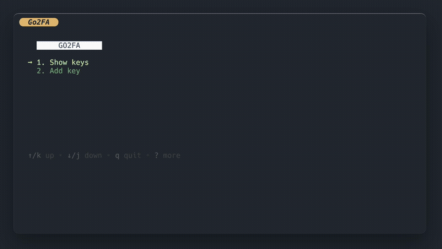

<p align="center">
    
    <h5 align="center">Store and use your TOTP keys right in the terminal</h5>
</p>

> English | [Русский](README_RU.md)

---

I got tired of constantly using Google Authenticator and switching between my PC and phone to confirm two-factor authentication. So I built this TUI that lets you store, manage, view, and copy 2FA codes in just a couple of keystrokes.

<p align="center">
  
</p>

---

# Description

Go2FA TOTP is a lightweight terminal application designed for secure storage and management of your Time-Based One-Time Password (TOTP) keys.

The TUI is built on [bubbletea](https://github.com/charmbracelet/bubbletea)

## Features
- **Secure Storage**: The TOTP vault stores your secrets in encrypted form, ensuring the safety of your sensitive information.
- **Quick Access**: Easily copy TOTP codes with a single command, eliminating the need for manual code entry or switching between apps.
- **Filtering**: Organize your TOTP codes using custom names and descriptions, making it easy to find and access the codes you need.
- **Lightweight**: The TOTP vault is a terminal application that requires minimal system resources and has no dependencies, written in Go.

## Installation


### [Homebrew](https://brew.sh) (Linux/MacOS)
> Make sure **Xclip** or **Xsel** is installed. Otherwise, copying to clipboard will not work.

```shell
brew install curkan/public/go2fa
```

### From Source

```shell
go install github.com/curkan/go2fa@latest
```

### Manual Installation

Download the [latest release](https://github.com/curkan/go2fa/releases/latest) and add the binary to your PATH.

Run with the command `go2fa`

### Viewing Keys
On the key viewing screen, you can filter, delete, and copy the desired TOTP key.

- `d` - trigger deletion (Enter - confirm, Esc - go back)
- `enter` - copy to clipboard. When copied, the left border becomes thicker.
- `/` - filter by name

### Adding Keys
To add a new key, enter the **Name** and **SecretKey**; Description is optional.\
SecretKey must be in base32 format, otherwise an error will be returned.

## Vault
A JSON-based vault is used for storing additional information in `vault.json`.\
On the first launch, the application will create a *publicKey* and *privateKey* to encrypt your Vault.

```json
{
  "iterator": 4,
  "db": "CtSRXlMkbXrMmLh/IeMiJCzRbzJkTMagWGVwnvaOkqroDUViVJaBaMbih258o..."
}
```
`db` - an encrypted field that stores the structure of name, description, secretKey\
`iterator` - an additional field that increments with each vault modification. The iterator allows you to quickly identify the previous version and restore it from a backup.

The open JSON format was chosen for convenient application extension. Not all additional fields need to be encrypted.


## File Structure
All used files are stored at: `$HOME/.local/share/go2fa`

```shell
go2fa
├── backups
├── keys
└── stores
```


`backups` - when adding/deleting keys, backups are created with the timestamp of the change. This allows you to restore the desired version. Backup files are encrypted, just like the main `vault.json` file.

`keys` - stores privateKey and publicKey

```shell
└── keys
    ├── private.pem
    └── public.pem
```

`stores` - vaults, currently only vault.json

## Testing

- **Run all tests**:
  - `go test ./...`
  - with coverage: `go test ./... -cover`

- **Where to write tests**:
  - Next to the code, in `*_test.go` files within the corresponding packages, for example: `internal/crypto/crypto_test.go`, `internal/addkey/addkey_test.go`, `internal/deletekey/deletekey_test.go`, `internal/twofactor/generate_test.go`.

- **Isolation from the real environment**:
  - Tests use an in-memory filesystem via `afero`. This prevents any changes to the real `$HOME/.local/share/go2fa`.
  - Basic test template:

```go
import (
    "testing"
    "go2fa/internal/crypto"
    "github.com/spf13/afero"
)

func TestSomething(t *testing.T) {
    crypto.FS = afero.NewMemMapFs()   // isolated FS
    t.Setenv("HOME", "/home/test")  // deterministic paths
    crypto.CreateDirs()
    crypto.GeneratePublicPrivateKeys()
    // ... test logic ...
}
```

## TODO:
- Add synchronization with a Git repository
- Add short commands for quickly copying the desired TOTP to clipboard
- Backup restoration screen


## Copyright and License

GO2FA is licensed under the terms of the MIT License. The full license text can be found in the [`LICENSE`](https://github.com/curkan/go2fa/blob/master/LICENSE) file.
