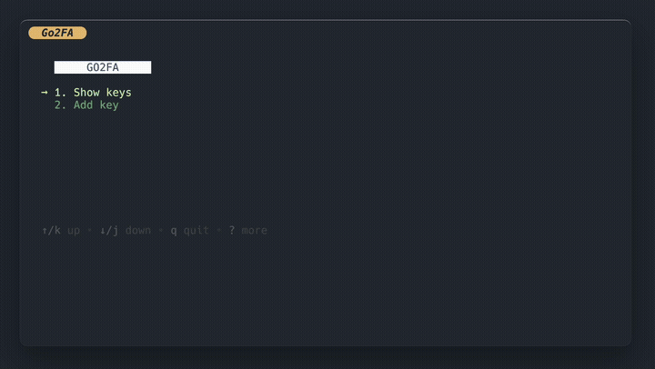

<p align="center">
    
    <h5 align="center">Храните и используйте свои TOTP ключи в терминале</h5>
</p>

---

Мне надоело постоянно использовать Google Authentificator и переключаться между ПК и телефоном для подтверждения двухфакторной аутентификации. Поэтому я сделал эту TUI, которая позволит хранить, управлять, просматривать, копировать 2FA ключ в пару нажатий.

<p align="center">
  
</p>

---

# Описание

Go2FA TOTP - это легковесное, терминальное приложение, предназначенное для безопасного хранения и управления вашими ключами Time-Based One-Time Password (TOTP). 

TUI основан на [bubbletea](https://github.com/charmbracelet/bubbletea)

## Функции
- **Безопасное хранение**: Хранилище TOTP хранит ваши секретные в зашифрованном виде, гарантируя безопасность вашей чувствительной информации.
- **Быстрый доступ**: Легко копируйте коды TOTP с помощью одной команды, устраняя необходимость ручного ввода кодов или переключения между приложениями.
- **Фильтрация**: Организуйте свои TOTP-коды с помощью пользовательских имен, описание, что позволяет легко найти и получить доступ к кодам, которые вам нужны.
- **Легковесность**: Хранилище TOTP - это терминальное приложение, требующее минимальных системных ресурсов и не имеющее зависимостей, написанное на Go.

## Быстрый старт

Скачайте [последний релиз](https://github.com/curkan/go2fa/releases/latest) и добавьте бинарник в ваш PATH.

Запустите с помощью команды `go2fa`

### Просмотр ключей
На экране просмотра ключей вы можете фильтровать, удалять и копировать нужный TOTP ключ.

- `d` - вызвать удаление (Enter - подтвердить, Esc - вернуться назад)
- `enter` - скопировать в буфер обмена. При копировании левая граница становится толще.
- `/` - фильтрация по имени

### Добавление ключей
Чтобы добавить новый ключ, введите **Имя** и **SecretKey**, Описание по желанию.\
SecretKey формата base32 иначе отобьет ошибку.

## Vault
Используется хранилище в формате JSON для дополнительной информации `vault.json`\
При первом запуске приложение создаст *publicKey* и *privateKey* для шифрования вашего Vault.

```json
{
  "iterator": 4,
  "db": "CtSRXlMkbXrMmLh/IeMiJCzRbzJkTMagWGVwnvaOkqroDUViVJaBaMbih258o..."
}
```
`db` - зашифрованное поле, к котором хранится структура name, description, secretKey\
`iterator` - дополнительное поле, которое инкрементируется при каждом изменении хранилища. По iterator можно быстро понять, какая версия была предыдущая и восстановить его из бекапа.

JSON структура с открытым форматом была выбрана для удобного расширения приложения. Не все дополнительные поля должны быть зашифрованы.


## Структура файлов
Все используемые файлы хранятся в пути: `$HOME/.local/share/go2fa`

```sheel
go2fa
├── backups
├── keys
└── stores
```


`backups` - при добавлении/удалении ключей создаются бекапы с временем, когда произошло изменение. Это позволит вам восстановить нужную версию. Файлы бекапов шифрвуются, как и основной файл `vault.json`

`keys` - хранятся privateKey и publicKey

```sheel
└── keys
    ├── private.pem
    └── public.pem
```

`stores` - хранилища, на текущий момент только vault.json

## TODO:
- Добавить синхронизацию в Git репозиторием
- Добавить короткие команды, для быстрого получения в clipboard нужного TOTP
- Экран восстановления из бекапа


## Авторское право и лицензия

GO2FA лицензирован в соответствии с условиями лицензии MIT. Полный текст лицензии можно найти в файле [`LICENSE`](https://github.com/curkan/go2fa/blob/master/LICENSE).
